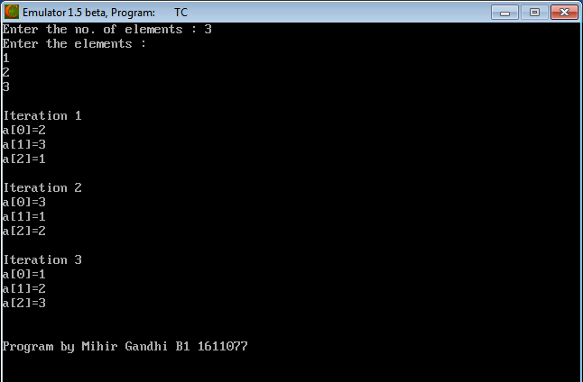
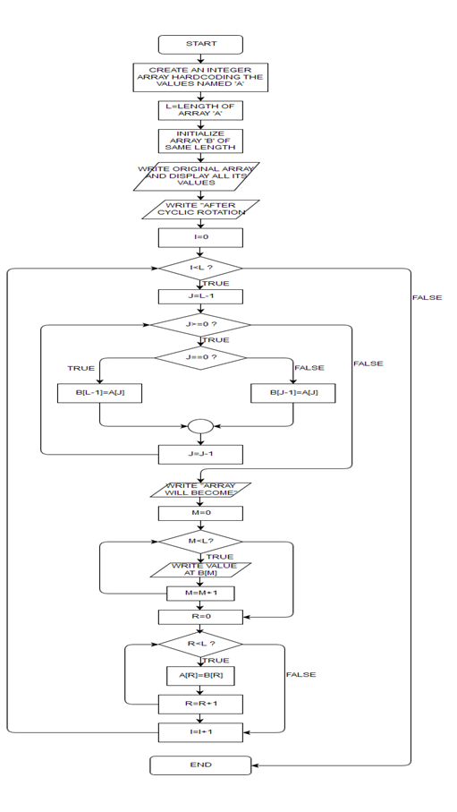

## Cyclic Rotation

-----------------------------------------
### Problem Definition:
Write a program to store n elements in an array and cyclically rotate the elements to its left by one position in each iteration. Run n iterations so that the original array is obtained in the end.

------------------------------------------
### Output:

    

------------------------------------------
### Flowchart:

 

