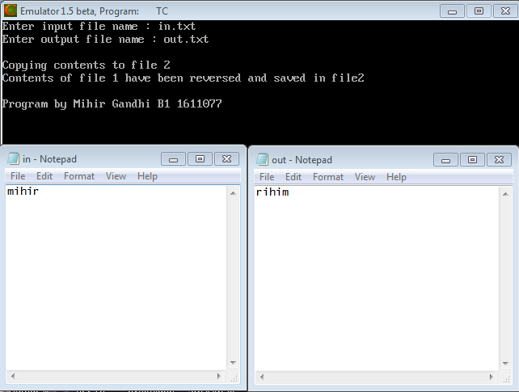

## Combination (Iterative)

-----------------------------------------
### Problem Definition:
Write a program to accept a file name from the user and write the contents of one file in reverse order into another file.

------------------------------------------
### Output:

    

------------------------------------------
### Flowchart:

 

