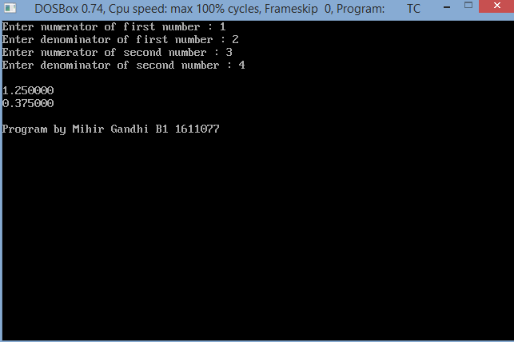

## Fraction - Structure and Operations

-----------------------------------------
### Problem Definition:
Write a program to create a structure ‘ratio’ which stores a fraction using two double values (num and deno). Write a program to perform addition and multiplication of two fractions. Create separate functions to add, multiply, and display.

------------------------------------------
### Output:

    

------------------------------------------
### Flowchart:

 

