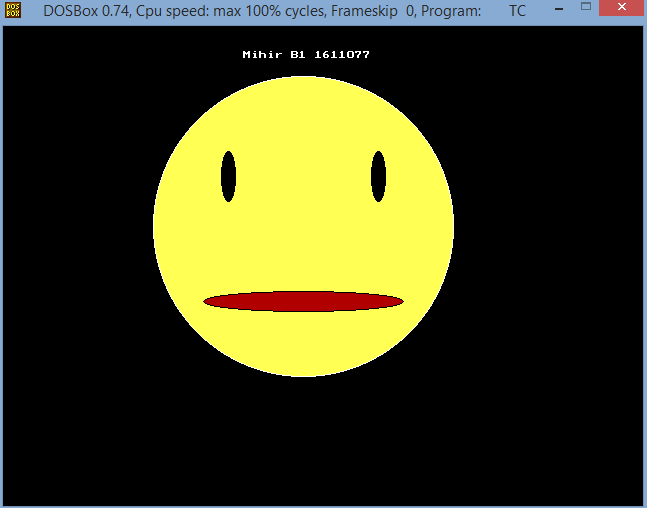

## Graphics

-----------------------------------------
### Problem Definition:
Write a program to display a _smiley face_ using the <strong> graphics </strong> library

------------------------------------------
### Output:

    

