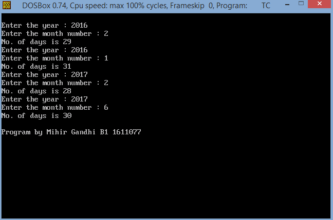
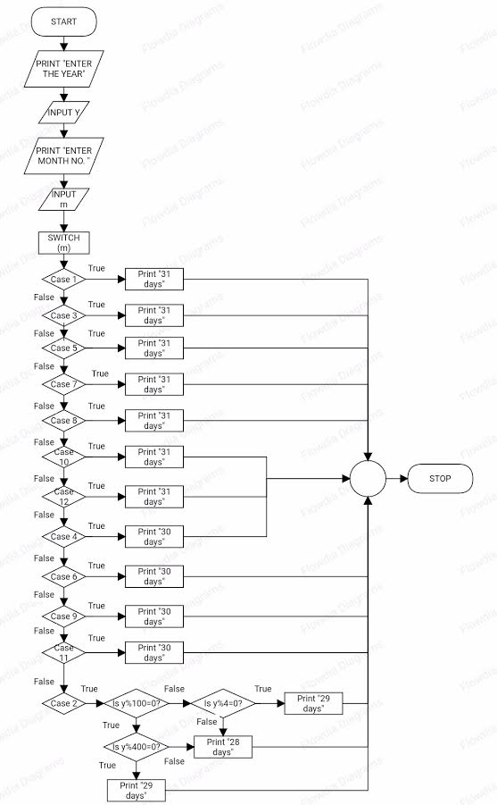

## Number of days in a month

-----------------------------------------
### Problem Definition:
Write a program to find number of days in a month in any year (including leap year).

------------------------------------------
### Output:

    

------------------------------------------
### Flowchart:

 

