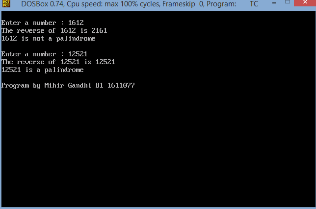
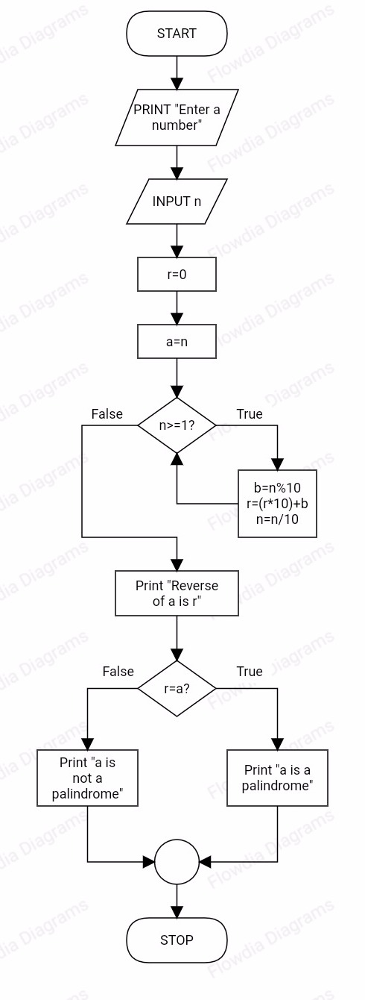

## Palindrome 

-----------------------------------------
### Problem Definition:
Write a program to reverse a given number and display whether it is a palindrome or not.

------------------------------------------
### Output:

    

------------------------------------------
### Flowchart:

 

