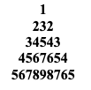
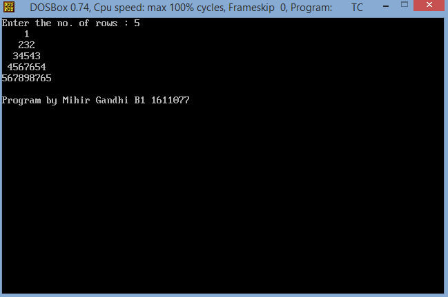
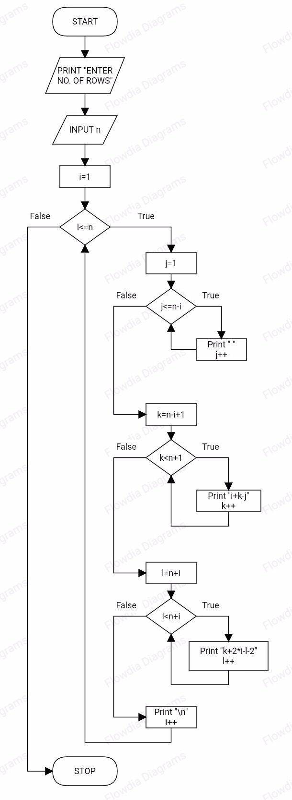

## Pyramid Pattern

-----------------------------------------
### Problem Definition:
Write a program to accept number of lines n from the user and display the given pattern on the screen.

    

------------------------------------------
### Output:

    

------------------------------------------
### Flowchart:

 

