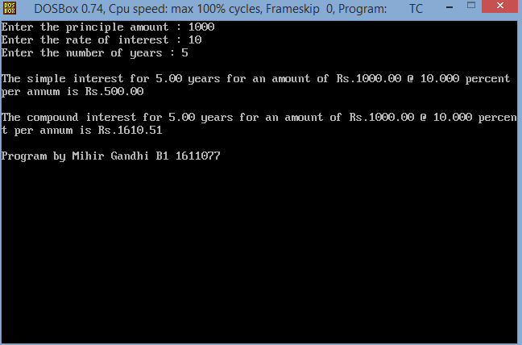

## Simple and Compount Interest

-----------------------------------------
### Problem Definition:
Write a program to compute simple interest and compound interest, given the principal amount, rate of interest, and the duration (in years).

------------------------------------------
### Output:

    

