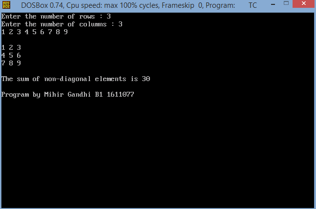
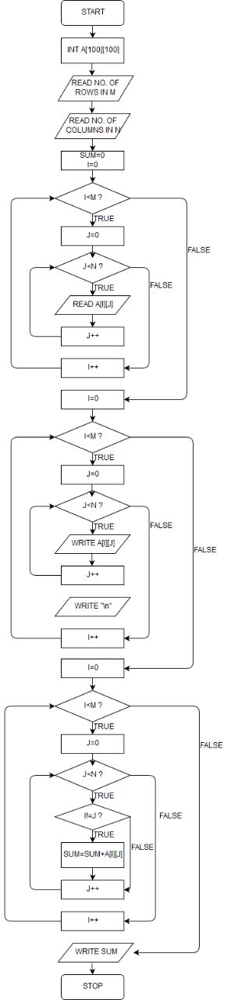

## Sum of non-diagonal elements

-----------------------------------------
### Problem Definition:
Write a program to calculate the sum of non-diagonal elements of a matrix.

------------------------------------------
### Output:

    

------------------------------------------
### Flowchart:

 

